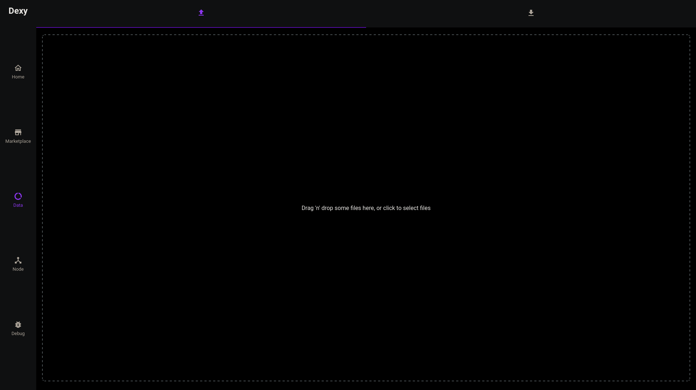
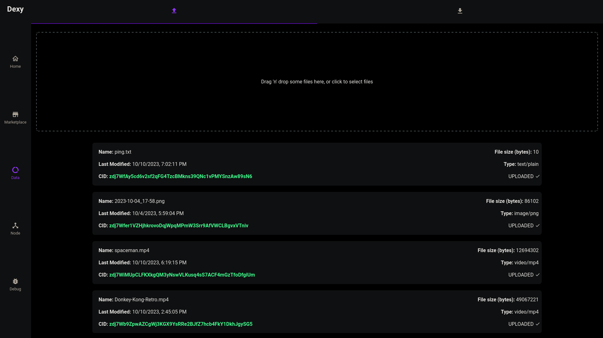
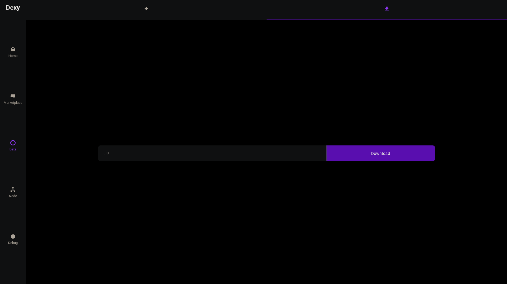

# Codex Frontend

A frontend for codex made with Flutter.


## Features

- Upload multiple files at once
- Dockerize frontend
- Show status of locally running codex node
- Upload to codex nodes
- View file Uploaded
- Download from codex nodes
- Now supports marketplace endpoints!


## Planned Features

- Show status of connection to codex peers
- Settings for the connection


## How to run it

 1. Clone repository
    ```shell
    git clone https://github.com/codex-storage/codex-frontend
    cd codex-frontend
    ```

 2. Grab your codex api link and define a variable for docker compose file
    ```shell
    export codex_url="http://localhost:8080"
    ```

 3. Run codex frontend
    ```shell
    docker compose up
    ```

 4. Go to [localhost:3000](http://localhost:3000)


## Screenshots




